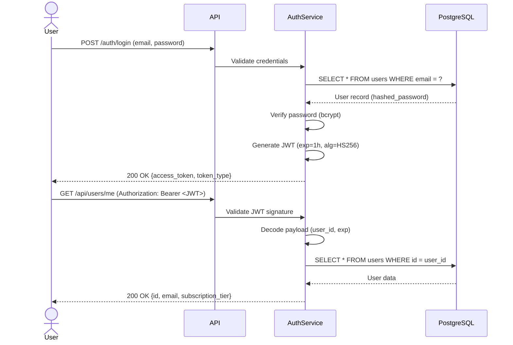

# API Strategy

**Last Updated**: 2025-11-12
**Project**: Ontologic API
**API Style**: REST
**Related Docs**: See `system-architecture.md` for authentication flows, `tech-stack.md` for FastAPI details

---

## API Design Principles

### Core Principles

1. **RESTful Resource Modeling**: Resources as nouns, HTTP verbs for actions
2. **Self-Documenting**: Auto-generated OpenAPI docs (FastAPI), descriptive field names
3. **Consistent Error Handling**: RFC 7807 Problem Details format
4. **Backwards Compatibility**: Additive changes only, no breaking changes without versioning
5. **Rate Limiting**: Tier-based quotas (FREE: 100 req/day, PREMIUM: 10K req/day)
6. **Idempotency**: Retry-safe operations (POST with idempotency keys for payments)

---

## Resource Design

### Resource Naming Conventions

**Rules**:
- Plural nouns for collections (`/users`, `/conversations`)
- Singular IDs for specific resources (`/users/{user_id}`)
- Lowercase, hyphen-separated (`/chat-conversations`, not `/chatConversations`)
- No verbs in URLs (use HTTP methods instead)

**Examples**:
```
✅ GET /api/users/{user_id}
✅ POST /api/chat/conversations
✅ DELETE /api/documents/{document_id}

❌ GET /api/getUser/{user_id}          (verb in URL)
❌ POST /api/create-conversation       (verb in URL)
❌ GET /api/Users/{user_id}            (capitalized)
```

### Resource Hierarchy

**Primary Resources**:

**Authentication**:
- `POST /auth/register` - User registration
- `POST /auth/login` - Login (returns JWT)
- `POST /auth/logout` - Logout (invalidate token)
- `POST /auth/refresh` - Refresh JWT token

**Users**:
- `GET /api/users/me` - Current user profile
- `PATCH /api/users/me` - Update profile
- `DELETE /api/users/me` - Delete account

**Philosopher Queries** (Core Feature):
- `POST /api/query` - Semantic query with philosopher context
- `GET /api/philosophers` - List available philosophers
- `GET /api/philosophers/{philosopher_name}` - Philosopher metadata

**Chat History**:
- `POST /api/chat/conversations` - Create new conversation
- `GET /api/chat/conversations` - List user's conversations
- `GET /api/chat/conversations/{conversation_id}` - Get conversation details
- `DELETE /api/chat/conversations/{conversation_id}` - Delete conversation
- `POST /api/chat/messages` - Add message to conversation
- `GET /api/chat/conversations/{conversation_id}/messages` - List messages

**Documents**:
- `POST /api/documents/upload` - Upload PDF/DOCX
- `GET /api/documents` - List uploaded documents
- `DELETE /api/documents/{document_id}` - Delete document

**Payments**:
- `POST /api/payments/create-intent` - Create Stripe payment intent
- `POST /api/payments/webhook` - Stripe webhook handler
- `GET /api/subscriptions/me` - Current subscription details
- `POST /api/subscriptions/upgrade` - Upgrade subscription tier

**Health & Monitoring**:
- `GET /health` - Health check (200 OK)
- `GET /health/ready` - Readiness check (dependencies)
- `GET /health/live` - Liveness check (application)
- `GET /metrics` - Prometheus metrics

---

## Authentication

### JWT Token-Based Authentication

**Flow**:


**Token Format**:
```json
{
  "sub": "user_id_123",
  "email": "user@example.com",
  "exp": 1699999999,
  "iat": 1699996399
}
```

**Token Lifetime**:
- Access token: 1 hour (short-lived)
- Refresh token: 30 days (long-lived, future implementation)

**Security**:
- Algorithm: HS256 (HMAC with SHA-256)
- Secret: 32-byte random string (environment variable `JWT_SECRET`)
- Signature verification on every protected route

**Protected Routes**:
```python
from fastapi import Depends
from app.core.security import get_current_user

@router.get("/api/users/me")
async def get_current_user_profile(
    user: User = Depends(get_current_user)
):
    return user
```

---

## Authorization

### Role-Based Access Control (RBAC)

**Roles**:
- `user`: Standard authenticated user (default)
- `superuser`: Admin access (database flag `is_superuser=true`)

**Subscription Tier-Based Access**:
- `FREE`: 100 API requests/day, no paper generation
- `BASIC`: 1,000 requests/day, basic features
- `PREMIUM`: 10,000 requests/day, paper generation, priority support
- `ACADEMIC`: 50,000 requests/day, all features, institutional billing

**Enforcement**:
```python
from app.core.security import require_subscription_tier

@router.post("/api/papers/generate")
async def generate_paper(
    user: User = Depends(require_subscription_tier(SubscriptionTier.PREMIUM))
):
    # Only PREMIUM+ users can generate papers
    return {"status": "generating"}
```

**Quota Tracking**:
- Middleware logs every request to `usage_records` table
- Daily aggregation: `SELECT SUM(tokens_used) FROM usage_records WHERE user_id=? AND billing_period=?`
- Rate limit exceeded: `429 Too Many Requests` with `Retry-After` header

---

## Versioning Strategy

### URL-Based Versioning (Planned for v2.0)

**Current**: No versioning (v1.0 implicit, all routes at `/api/*`)

**Future** (when breaking changes needed):
```
/api/v1/users/me  (current, stable)
/api/v2/users/me  (new version with breaking changes)
```

**Migration Path**:
1. Introduce `/api/v2/*` routes with new contract
2. Maintain `/api/v1/*` routes for 6 months (deprecation period)
3. Add `Deprecation` header to v1 responses: `Deprecation: Sun, 01 Jun 2026 00:00:00 GMT`
4. Sunset v1 after 6 months, return `410 Gone` with migration guide

**Versioning Rules**:
- **Major version (v1 → v2)**: Breaking changes (remove field, change response structure)
- **Minor version**: Additive changes (new fields, new endpoints) - no version bump needed

**Example Breaking Change**:
```json
// v1 (current)
{
  "user_id": 123,
  "name": "John Doe"
}

// v2 (breaking: rename field)
{
  "id": 123,
  "full_name": "John Doe"
}
```

---

## Error Handling

### RFC 7807 Problem Details

**Format**: Standardized error responses following RFC 7807

**Structure**:
```json
{
  "type": "https://ontologic.api/errors/rate-limit-exceeded",
  "title": "Rate Limit Exceeded",
  "status": 429,
  "detail": "You have exceeded your daily quota of 100 requests. Upgrade to BASIC tier for 1,000 requests/day.",
  "instance": "/api/query",
  "quota_limit": 100,
  "quota_used": 100,
  "quota_reset": "2025-11-13T00:00:00Z"
}
```

**HTTP Status Codes**:

| Code | Meaning | Usage |
|------|---------|-------|
| 200 | OK | Successful GET, PATCH, DELETE |
| 201 | Created | Successful POST (resource created) |
| 204 | No Content | Successful DELETE (no response body) |
| 400 | Bad Request | Invalid request body, missing required fields |
| 401 | Unauthorized | Missing or invalid JWT token |
| 402 | Payment Required | Subscription upgrade needed |
| 403 | Forbidden | Insufficient permissions (not superuser) |
| 404 | Not Found | Resource doesn't exist |
| 409 | Conflict | Resource already exists (duplicate email) |
| 422 | Unprocessable Entity | Validation error (Pydantic validation) |
| 429 | Too Many Requests | Rate limit exceeded |
| 500 | Internal Server Error | Unexpected server error |
| 502 | Bad Gateway | External service failure (Ollama, Qdrant) |
| 503 | Service Unavailable | Database connection failure |

**Error Types**:

**Validation Error (422)**:
```json
{
  "type": "https://ontologic.api/errors/validation-error",
  "title": "Validation Error",
  "status": 422,
  "detail": "Request body validation failed",
  "errors": [
    {
      "loc": ["body", "query"],
      "msg": "field required",
      "type": "value_error.missing"
    }
  ]
}
```

**Authentication Error (401)**:
```json
{
  "type": "https://ontologic.api/errors/invalid-token",
  "title": "Invalid Token",
  "status": 401,
  "detail": "JWT token is expired or invalid. Please login again."
}
```

**Rate Limit Error (429)**:
```json
{
  "type": "https://ontologic.api/errors/rate-limit-exceeded",
  "title": "Rate Limit Exceeded",
  "status": 429,
  "detail": "You have exceeded your daily quota. Upgrade your subscription for higher limits.",
  "quota_limit": 100,
  "quota_used": 100,
  "quota_reset": "2025-11-13T00:00:00Z"
}
```

**Implementation**:
```python
from fastapi import HTTPException, status

class ProblemDetailException(HTTPException):
    def __init__(self, status_code: int, title: str, detail: str, **kwargs):
        self.status_code = status_code
        self.detail = {
            "type": f"https://ontologic.api/errors/{title.lower().replace(' ', '-')}",
            "title": title,
            "status": status_code,
            "detail": detail,
            **kwargs
        }

# Usage
raise ProblemDetailException(
    status_code=429,
    title="Rate Limit Exceeded",
    detail="You have exceeded your daily quota.",
    quota_limit=100,
    quota_used=100
)
```

---

## Rate Limiting

### Tier-Based Quotas

**Strategy**: Token bucket algorithm per user per day

**Quotas**:

| Tier | Daily Requests | Requests/Minute | Tokens/Month |
|------|---------------|-----------------|--------------|
| FREE | 100 | 10 | 50,000 |
| BASIC | 1,000 | 50 | 500,000 |
| PREMIUM | 10,000 | 100 | 5,000,000 |
| ACADEMIC | 50,000 | 500 | 25,000,000 |

**Headers**:
```http
X-RateLimit-Limit: 100
X-RateLimit-Remaining: 42
X-RateLimit-Reset: 1699999999
Retry-After: 3600
```

**Implementation**:
```python
from slowapi import Limiter, _rate_limit_exceeded_handler
from slowapi.util import get_remote_address

limiter = Limiter(key_func=get_remote_address)

@app.get("/api/query")
@limiter.limit("10/minute")
async def query_philosopher(request: Request):
    # Rate limited to 10 requests per minute
    pass
```

**Enforcement**:
- Middleware tracks requests in `usage_records` table
- Daily aggregation checks against tier quota
- Exceeds quota → `429 Too Many Requests`

---

## Request/Response Patterns

### Standard Patterns

**Query Request**:
```http
POST /api/query
Content-Type: application/json
Authorization: Bearer <JWT>

{
  "query": "What is virtue?",
  "philosopher": "Aristotle",
  "immersive_mode": true,
  "top_k": 10
}
```

**Query Response**:
```http
HTTP/1.1 200 OK
Content-Type: application/json
X-RateLimit-Limit: 100
X-RateLimit-Remaining: 99

{
  "response": "According to Aristotle, virtue (arete) is excellence of character...",
  "sources": [
    {
      "text": "Virtue is a mean between two vices...",
      "source": "Nicomachean Ethics, Book II",
      "score": 0.92
    }
  ],
  "metadata": {
    "tokens_used": 512,
    "latency_ms": 2340,
    "model": "qwen3:8b",
    "cached": false
  }
}
```

**Streaming Response** (Server-Sent Events):
```http
POST /api/query?stream=true
Content-Type: application/json

{
  "query": "Explain Plato's theory of forms",
  "philosopher": "Plato"
}
```

**Response**:
```http
HTTP/1.1 200 OK
Content-Type: text/event-stream

data: {"chunk": "Plato's theory of forms ", "done": false}

data: {"chunk": "posits that abstract forms ", "done": false}

data: {"chunk": "are more real than physical objects.", "done": true}
```

---

## Idempotency

### Payment Operations

**Strategy**: Idempotency keys for payment intents

**Implementation**:
```http
POST /api/payments/create-intent
Content-Type: application/json
Idempotency-Key: unique-key-12345

{
  "amount": 1000,
  "currency": "usd"
}
```

**Behavior**:
- First request: Creates payment intent, returns 201 Created
- Duplicate request (same key): Returns existing intent, 200 OK
- Different request (same key): Returns 409 Conflict

**Database Constraint**:
```sql
-- Unique constraint on stripe_payment_intent_id prevents duplicates
CREATE UNIQUE INDEX ON payment_records (stripe_payment_intent_id);
```

---

## Pagination

### Cursor-Based Pagination (Preferred)

**Why Cursor-Based**:
- Consistent results (no skipped/duplicate rows when data changes)
- Efficient for large datasets (indexed cursor column)

**Request**:
```http
GET /api/chat/conversations?limit=20&cursor=2025-11-12T10:00:00Z
```

**Response**:
```json
{
  "data": [
    {"id": 1, "philosopher": "Aristotle", "created_at": "2025-11-12T09:00:00Z"},
    {"id": 2, "philosopher": "Plato", "created_at": "2025-11-12T08:00:00Z"}
  ],
  "next_cursor": "2025-11-12T08:00:00Z",
  "has_more": true
}
```

**Query**:
```sql
SELECT * FROM chat_conversations
WHERE created_at < '2025-11-12T10:00:00Z'
ORDER BY created_at DESC
LIMIT 20;
```

---

## CORS Policy

**Configuration**:
```python
from fastapi.middleware.cors import CORSMiddleware

app.add_middleware(
    CORSMiddleware,
    allow_origins=["https://app.ontologic.com"],  # Specific origins, not "*"
    allow_credentials=True,
    allow_methods=["GET", "POST", "PATCH", "DELETE"],
    allow_headers=["Authorization", "Content-Type"],
)
```

**Allowed Origins**:
- Development: `http://localhost:3000`
- Production: `https://app.ontologic.com`

---

## API Documentation

### OpenAPI (Swagger)

**Auto-Generated**: FastAPI generates OpenAPI 3.0 spec automatically

**Access**:
- Swagger UI: `https://api.ontologic.com/docs`
- ReDoc: `https://api.ontologic.com/redoc`
- OpenAPI JSON: `https://api.ontologic.com/openapi.json`

**Enhancements**:
```python
from fastapi import FastAPI

app = FastAPI(
    title="Ontologic API",
    description="Semantic philosophical knowledge retrieval",
    version="1.0.0",
    docs_url="/docs",
    redoc_url="/redoc",
    openapi_url="/openapi.json"
)

@app.post(
    "/api/query",
    summary="Query philosopher",
    description="Perform semantic query with philosopher-specific context",
    response_description="Generated response with sources",
    tags=["Query"]
)
async def query_philosopher(request: QueryRequest):
    pass
```

---

## Webhooks

### Stripe Webhook Handling

**Endpoint**: `POST /api/payments/webhook`

**Signature Verification**:
```python
import stripe

@router.post("/api/payments/webhook")
async def stripe_webhook(request: Request):
    payload = await request.body()
    sig_header = request.headers.get("Stripe-Signature")

    try:
        event = stripe.Webhook.construct_event(
            payload, sig_header, settings.STRIPE_WEBHOOK_SECRET
        )
    except ValueError:
        raise HTTPException(400, "Invalid payload")
    except stripe.error.SignatureVerificationError:
        raise HTTPException(400, "Invalid signature")

    # Handle event
    if event["type"] == "payment_intent.succeeded":
        handle_payment_succeeded(event["data"]["object"])

    return {"status": "success"}
```

**Webhook Events**:
- `payment_intent.succeeded` → Create payment record
- `customer.subscription.created` → Create subscription record
- `customer.subscription.updated` → Update subscription tier/status
- `customer.subscription.deleted` → Cancel subscription
- `charge.refunded` → Create refund record
- `charge.dispute.created` → Create dispute record

**Idempotency**: Stripe-Event-ID prevents duplicate processing

---

## Security Best Practices

1. **JWT Secret Rotation**: Rotate `JWT_SECRET` every 90 days
2. **Rate Limiting**: Enforce tier-based quotas to prevent abuse
3. **CORS Restrictions**: Whitelist specific origins, not `*`
4. **Input Validation**: Pydantic models validate all request bodies
5. **SQL Injection Prevention**: Parameterized queries (SQLModel ORM)
6. **Webhook Signature Verification**: Always verify Stripe signatures
7. **HTTPS Only**: No plaintext HTTP in production
8. **Sensitive Data**: Never log JWT tokens, passwords, or API keys

---

## Performance Targets

| Metric | Target | Measurement |
|--------|--------|-------------|
| API Response Time (p50) | <200ms | Prometheus `http_request_duration_seconds` |
| API Response Time (p95) | <500ms | Prometheus histogram |
| API Response Time (p99) | <2s | Prometheus histogram |
| LLM Query Time (p50) | <3s | Custom LLM duration metric |
| Vector Search Time (p95) | <50ms | Qdrant search duration |
| Cache Hit Rate | >60% | Custom cache hit metric |
| Error Rate | <1% | 5xx status code count |

**Monitoring**:
```python
from prometheus_client import Histogram

http_request_duration = Histogram(
    "http_request_duration_seconds",
    "HTTP request duration in seconds",
    ["method", "endpoint", "status"]
)
```

---

## References

- FastAPI Documentation: https://fastapi.tiangolo.com
- RFC 7807 Problem Details: https://tools.ietf.org/html/rfc7807
- OpenAPI Specification: https://swagger.io/specification
- JWT Best Practices: https://tools.ietf.org/html/rfc8725
- Stripe Webhooks: https://stripe.com/docs/webhooks
