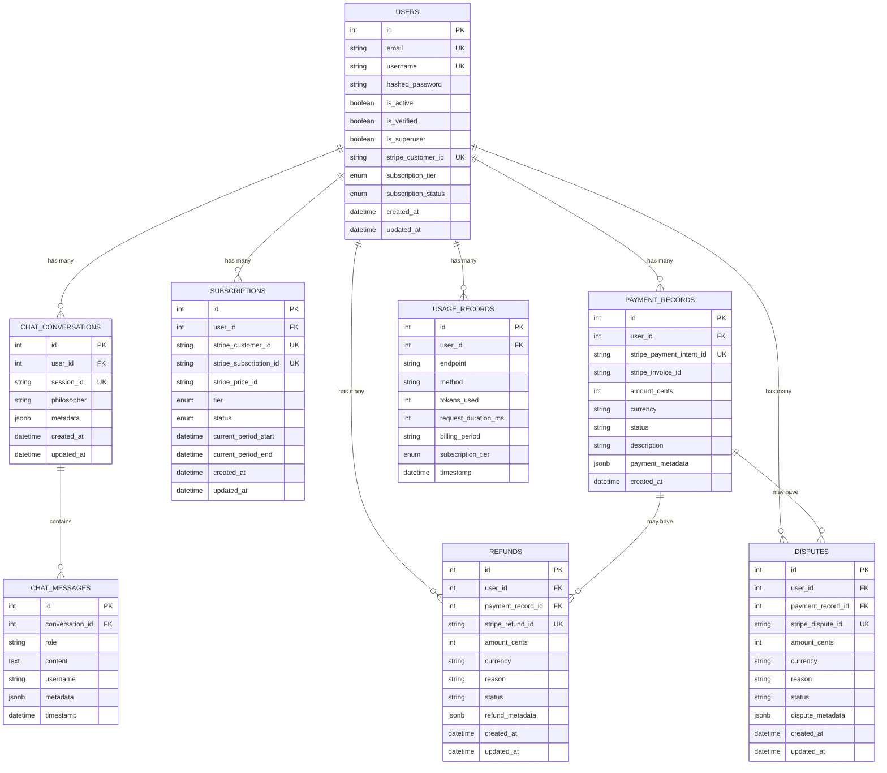

# Data Architecture

**Last Updated**: 2025-11-12
**Project**: Ontologic API
**Database**: PostgreSQL 15+
**Related Docs**: See `tech-stack.md` for database technology choices, `system-architecture.md` for data flows

---

## Entity Relationship Diagram

**High-level relationships between core entities:**



---

## Entity Specifications

### Users

**Purpose**: Core user authentication and subscription state

**Schema**:
```sql
CREATE TABLE users (
    id SERIAL PRIMARY KEY,
    email VARCHAR(255) NOT NULL UNIQUE,
    username VARCHAR(100) NOT NULL UNIQUE,
    hashed_password VARCHAR(255) NOT NULL,
    is_active BOOLEAN NOT NULL DEFAULT TRUE,
    is_verified BOOLEAN NOT NULL DEFAULT FALSE,
    is_superuser BOOLEAN NOT NULL DEFAULT FALSE,
    stripe_customer_id VARCHAR(255) UNIQUE,
    subscription_tier subscription_tier_enum NOT NULL DEFAULT 'FREE',
    subscription_status subscription_status_enum NOT NULL DEFAULT 'ACTIVE',
    created_at TIMESTAMPTZ DEFAULT CURRENT_TIMESTAMP,
    updated_at TIMESTAMPTZ
);

-- Trigger for updated_at
CREATE TRIGGER update_users_updated_at
    BEFORE UPDATE ON users
    FOR EACH ROW
    EXECUTE FUNCTION update_updated_at_column();
```

**Indexes**:
- `PRIMARY KEY (id)` - Fast lookups by user ID
- `UNIQUE INDEX (email)` - Email-based authentication
- `UNIQUE INDEX (username)` - Username uniqueness
- `UNIQUE INDEX (stripe_customer_id)` - Stripe integration lookups
- `INDEX (subscription_tier, subscription_status)` - Tier-based queries

**Data Lifecycle**:
- **Creation**: POST /auth/register → bcrypt password hash, default FREE tier
- **Update**: PATCH /api/users/me → username, email changes (triggers updated_at)
- **Deletion**: Soft delete (set is_active=false), retain for 90 days, hard delete after
- **Retention**: Active users: indefinite, Inactive users: 90 days

**Relationships**:
- One-to-many: chat_conversations, subscriptions, payment_records, usage_records
- Referenced by: All user-specific tables via user_id foreign key

---

### Chat Conversations

**Purpose**: Group chat messages into persistent conversation sessions

**Schema**:
```sql
CREATE TABLE chat_conversations (
    id SERIAL PRIMARY KEY,
    user_id INTEGER NOT NULL REFERENCES users(id) ON DELETE CASCADE,
    session_id VARCHAR(255) NOT NULL UNIQUE,
    philosopher VARCHAR(100) NOT NULL,
    metadata JSONB DEFAULT '{}',
    created_at TIMESTAMPTZ DEFAULT CURRENT_TIMESTAMP,
    updated_at TIMESTAMPTZ DEFAULT CURRENT_TIMESTAMP
);
```

**Indexes**:
- `PRIMARY KEY (id)` - Fast conversation lookups
- `UNIQUE INDEX (session_id)` - Session-based retrieval
- `INDEX (user_id, updated_at DESC)` - Recent conversations per user
- `INDEX (philosopher)` - Philosopher-specific queries

**JSONB Metadata Structure**:
```json
{
  "immersive_mode": true,
  "context_window": 4096,
  "model": "qwen3:8b",
  "search_params": {
    "top_k": 10,
    "hybrid_alpha": 0.5
  }
}
```

**Data Lifecycle**:
- **Creation**: POST /api/chat/conversations → new session_id (UUID)
- **Update**: PATCH /api/chat/conversations/{id} → metadata changes
- **Deletion**: Cascade from users (ON DELETE CASCADE), or cron job deletes >90 days old
- **Retention**: Active users: 90 days, Deleted users: immediate cascade

**Relationships**:
- Many-to-one: users (via user_id)
- One-to-many: chat_messages (via conversation_id)

---

### Chat Messages

**Purpose**: Store individual messages within conversations

**Schema**:
```sql
CREATE TABLE chat_messages (
    id SERIAL PRIMARY KEY,
    conversation_id INTEGER NOT NULL REFERENCES chat_conversations(id) ON DELETE CASCADE,
    role VARCHAR(50) NOT NULL CHECK (role IN ('user', 'assistant', 'system')),
    content TEXT NOT NULL,
    username VARCHAR(100),
    metadata JSONB DEFAULT '{}',
    timestamp TIMESTAMPTZ DEFAULT CURRENT_TIMESTAMP
);
```

**Indexes**:
- `PRIMARY KEY (id)` - Fast message lookups
- `INDEX (conversation_id, timestamp)` - Chronological message retrieval
- `INDEX (timestamp DESC)` - Recent messages (for cleanup job)
- Optimized index: `(conversation_id, timestamp)` covers 90% of queries

**JSONB Metadata Structure**:
```json
{
  "tokens_used": 512,
  "latency_ms": 2340,
  "model": "qwen3:8b",
  "search_results_count": 10,
  "cached": false
}
```

**Data Lifecycle**:
- **Creation**: POST /api/chat/messages → append to conversation
- **Update**: No updates (immutable chat history)
- **Deletion**: Cascade from chat_conversations (ON DELETE CASCADE)
- **Retention**: 90 days (aligned with conversations)

**Performance Notes**:
- Large text content (up to 10KB per message)
- Query pattern: `SELECT * FROM chat_messages WHERE conversation_id = ? ORDER BY timestamp`
- Optimization: Index on (conversation_id, timestamp) covers query + sort

---

### Subscriptions

**Purpose**: Track Stripe subscription state per user

**Schema**:
```sql
CREATE TABLE subscriptions (
    id SERIAL PRIMARY KEY,
    user_id INTEGER NOT NULL REFERENCES users(id) ON DELETE CASCADE,
    stripe_customer_id VARCHAR(255) NOT NULL UNIQUE,
    stripe_subscription_id VARCHAR(255) UNIQUE,
    stripe_price_id VARCHAR(255),
    tier subscription_tier_enum NOT NULL,
    status subscription_status_enum NOT NULL,
    current_period_start TIMESTAMP,
    current_period_end TIMESTAMP,
    created_at TIMESTAMPTZ DEFAULT CURRENT_TIMESTAMP,
    updated_at TIMESTAMPTZ
);

-- Enums
CREATE TYPE subscription_tier_enum AS ENUM ('FREE', 'BASIC', 'PREMIUM', 'ACADEMIC');
CREATE TYPE subscription_status_enum AS ENUM ('ACTIVE', 'CANCELED', 'INCOMPLETE', 'INCOMPLETE_EXPIRED', 'PAST_DUE', 'TRIALING', 'UNPAID');
```

**Indexes**:
- `PRIMARY KEY (id)` - Fast subscription lookups
- `UNIQUE INDEX (stripe_customer_id)` - Stripe customer lookups
- `UNIQUE INDEX (stripe_subscription_id)` - Stripe subscription lookups
- `INDEX (user_id, status)` - User subscription status queries
- `INDEX (tier, status)` - Tier-based reporting

**Data Lifecycle**:
- **Creation**: Stripe webhook (customer.subscription.created) → INSERT
- **Update**: Stripe webhook (customer.subscription.updated) → UPDATE tier, status, period dates
- **Deletion**: Soft delete (status='CANCELED'), retain for billing history
- **Retention**: Indefinite (billing records)

**Sync Strategy**:
- **Source of truth**: Stripe API
- **Sync frequency**: Real-time via webhooks (customer.subscription.*)
- **Drift detection**: Daily cron job compares subscriptions table with Stripe API, logs discrepancies

---

### Payment Records

**Purpose**: Audit trail of all payment transactions

**Schema**:
```sql
CREATE TABLE payment_records (
    id SERIAL PRIMARY KEY,
    user_id INTEGER NOT NULL REFERENCES users(id) ON DELETE CASCADE,
    stripe_payment_intent_id VARCHAR(255) NOT NULL UNIQUE,
    stripe_invoice_id VARCHAR(255),
    amount_cents INTEGER NOT NULL,
    currency VARCHAR(3) NOT NULL DEFAULT 'usd',
    status VARCHAR(50) NOT NULL,
    description TEXT,
    payment_metadata JSONB DEFAULT '{}',
    created_at TIMESTAMPTZ DEFAULT CURRENT_TIMESTAMP
);
```

**Indexes**:
- `PRIMARY KEY (id)` - Fast payment lookups
- `UNIQUE INDEX (stripe_payment_intent_id)` - Idempotent webhook processing
- `INDEX (stripe_invoice_id)` - Invoice-based queries
- `INDEX (user_id, created_at DESC)` - User payment history
- `INDEX (user_id, status)` - User payment status queries
- `INDEX (status, created_at)` - Status-based reporting

**JSONB Metadata Structure**:
```json
{
  "subscription_tier": "PREMIUM",
  "billing_period": "2025-11",
  "payment_method": "card",
  "card_last4": "4242",
  "card_brand": "visa"
}
```

**Data Lifecycle**:
- **Creation**: Stripe webhook (payment_intent.succeeded) → INSERT
- **Update**: No updates (immutable audit trail)
- **Deletion**: Never deleted (financial audit requirement)
- **Retention**: Indefinite (7 years for tax compliance)

**Idempotency**:
- `stripe_payment_intent_id` UNIQUE constraint prevents duplicate webhook processing
- Query: `INSERT INTO payment_records ... ON CONFLICT (stripe_payment_intent_id) DO NOTHING`

---

### Usage Records

**Purpose**: Track API usage per user for quota enforcement and billing

**Schema**:
```sql
CREATE TABLE usage_records (
    id SERIAL PRIMARY KEY,
    user_id INTEGER NOT NULL REFERENCES users(id) ON DELETE CASCADE,
    endpoint VARCHAR(255) NOT NULL,
    method VARCHAR(10) NOT NULL,
    tokens_used INTEGER NOT NULL,
    request_duration_ms INTEGER,
    billing_period VARCHAR(7) NOT NULL,  -- Format: "YYYY-MM"
    subscription_tier subscription_tier_enum NOT NULL,
    timestamp TIMESTAMPTZ DEFAULT CURRENT_TIMESTAMP
);
```

**Indexes**:
- `PRIMARY KEY (id)` - Fast usage lookups
- `INDEX (user_id, billing_period)` - Monthly usage per user
- `INDEX (user_id, timestamp DESC)` - Recent usage per user
- `INDEX (endpoint, timestamp)` - Endpoint-specific analytics
- `INDEX (billing_period)` - Period-based aggregation
- `INDEX (subscription_tier)` - Tier-based analytics

**Data Lifecycle**:
- **Creation**: Every API request → INSERT via middleware
- **Update**: No updates (immutable usage log)
- **Deletion**: Retention policy (delete >12 months old)
- **Retention**: 12 months (billing cycle + tax year)

**Aggregation Queries**:
```sql
-- Monthly usage per user
SELECT user_id, SUM(tokens_used) AS total_tokens
FROM usage_records
WHERE billing_period = '2025-11'
GROUP BY user_id;

-- Quota enforcement
SELECT SUM(tokens_used) AS used_tokens
FROM usage_records
WHERE user_id = ? AND billing_period = ?;
```

---

### Refunds

**Purpose**: Track refund transactions linked to payment records

**Schema**:
```sql
CREATE TABLE refunds (
    id SERIAL PRIMARY KEY,
    user_id INTEGER NOT NULL REFERENCES users(id) ON DELETE CASCADE,
    payment_record_id INTEGER NOT NULL REFERENCES payment_records(id),
    stripe_refund_id VARCHAR(255) NOT NULL UNIQUE,
    amount_cents INTEGER NOT NULL,
    currency VARCHAR(3) NOT NULL DEFAULT 'usd',
    reason VARCHAR(255),
    status VARCHAR(50) NOT NULL,
    refund_metadata JSONB DEFAULT '{}',
    created_at TIMESTAMPTZ DEFAULT CURRENT_TIMESTAMP,
    updated_at TIMESTAMPTZ
);
```

**Indexes**:
- `PRIMARY KEY (id)` - Fast refund lookups
- `UNIQUE INDEX (stripe_refund_id)` - Idempotent webhook processing
- `INDEX (payment_record_id)` - Refunds per payment
- `INDEX (user_id, created_at DESC)` - User refund history
- `INDEX (status)` - Status-based reporting

**Data Lifecycle**:
- **Creation**: Stripe webhook (charge.refunded) → INSERT
- **Update**: Stripe webhook (refund.updated) → UPDATE status
- **Deletion**: Never deleted (financial audit requirement)
- **Retention**: Indefinite (7 years for tax compliance)

---

### Disputes

**Purpose**: Track chargeback disputes linked to payment records

**Schema**:
```sql
CREATE TABLE disputes (
    id SERIAL PRIMARY KEY,
    user_id INTEGER NOT NULL REFERENCES users(id) ON DELETE CASCADE,
    payment_record_id INTEGER NOT NULL REFERENCES payment_records(id),
    stripe_dispute_id VARCHAR(255) NOT NULL UNIQUE,
    amount_cents INTEGER NOT NULL,
    currency VARCHAR(3) NOT NULL DEFAULT 'usd',
    reason VARCHAR(255),
    status VARCHAR(50) NOT NULL,
    dispute_metadata JSONB DEFAULT '{}',
    created_at TIMESTAMPTZ DEFAULT CURRENT_TIMESTAMP,
    updated_at TIMESTAMPTZ
);
```

**Indexes**:
- `PRIMARY KEY (id)` - Fast dispute lookups
- `UNIQUE INDEX (stripe_dispute_id)` - Idempotent webhook processing
- `INDEX (payment_record_id)` - Disputes per payment
- `INDEX (user_id, status)` - User dispute status queries
- `INDEX (status)` - Status-based reporting

**Data Lifecycle**:
- **Creation**: Stripe webhook (charge.dispute.created) → INSERT
- **Update**: Stripe webhook (charge.dispute.updated) → UPDATE status
- **Deletion**: Never deleted (legal requirement)
- **Retention**: Indefinite (legal compliance)

---

## Storage Strategy

### Table Sizes (Current Estimates)

| Table | Rows (1K users) | Rows (10K users) | Avg Row Size | Total Size (10K users) |
|-------|----------------|------------------|--------------|------------------------|
| users | 1,000 | 10,000 | 400 bytes | 4 MB |
| chat_conversations | 10,000 | 100,000 | 300 bytes | 30 MB |
| chat_messages | 100,000 | 1,000,000 | 2 KB | 2 GB |
| subscriptions | 1,000 | 10,000 | 300 bytes | 3 MB |
| payment_records | 5,000 | 50,000 | 500 bytes | 25 MB |
| usage_records | 1,000,000 | 10,000,000 | 200 bytes | 2 GB |
| refunds | 100 | 1,000 | 400 bytes | 400 KB |
| disputes | 10 | 100 | 400 bytes | 40 KB |

**Total Database Size** (10K users): ~4.1 GB

### Partitioning Strategy

**Current**: No partitioning (adequate for medium scale)

**Future** (if usage_records or chat_messages exceed 10M rows):
- **Table**: usage_records
- **Partition Key**: billing_period (monthly partitions)
- **Strategy**: Range partitioning (`PARTITION BY RANGE (billing_period)`)
- **Benefit**: Faster queries, easier retention policy enforcement (DROP old partitions)

**Example**:
```sql
CREATE TABLE usage_records (
    -- columns
) PARTITION BY RANGE (billing_period);

CREATE TABLE usage_records_2025_11 PARTITION OF usage_records
    FOR VALUES FROM ('2025-11') TO ('2025-12');
```

---

## Migration Strategy

**Tool**: Alembic 1.16.5

**Migration Files** (chronological):
1. `4642b31090bc_add_users_table_for_authentication.py` - Initial users table
2. `2a60609c7df4_add_chat_conversations_and_messages_.py` - Chat tables
3. `cb8a1baee725_add_payment_infrastructure_and_user_.py` - Payment system
4. `ebaa477edc3e_add_refund_and_dispute_tables.py` - Refund/dispute tables
5. `c7562c0a8dd5_add_onupdate_trigger_to_user_updated_at_.py` - Trigger for updated_at
6. `7878026f55e5_add_username_to_chat_tables.py` - Username column in chat
7. `optimize_chat_indexes.py` - Performance optimization indexes

**Migration Process**:
```bash
# Generate new migration
alembic revision --autogenerate -m "description"

# Review migration file (ALWAYS review auto-generated migrations)
vim alembic/versions/XXXX_description.py

# Apply migration
alembic upgrade head

# Rollback (if needed)
alembic downgrade -1
```

**Testing Migrations**:
1. Apply on dev database
2. Test API endpoints affected by schema change
3. Verify indexes exist (`EXPLAIN ANALYZE` on key queries)
4. Apply on staging
5. Apply on production (with backup)

---

## Data Retention Policies

**Policy**: Balance user privacy, legal compliance, and operational needs

| Data Type | Retention Period | Deletion Method | Rationale |
|-----------|------------------|----------------|-----------|
| Active user data | Indefinite | N/A | Core operational data |
| Inactive users (is_active=false) | 90 days | Hard delete | GDPR right to be forgotten |
| Chat conversations | 90 days (from last message) | Hard delete | Privacy, no long-term need |
| Chat messages | 90 days (cascade from conversations) | Cascade delete | Linked to conversations |
| Payment records | 7 years | Never deleted | Tax compliance (IRS, EU VAT) |
| Usage records | 12 months | Hard delete | Billing cycle complete |
| Refunds | 7 years | Never deleted | Tax compliance |
| Disputes | Indefinite | Never deleted | Legal compliance |

**Implementation**:
```sql
-- Cron job (daily at 2am UTC)
-- Delete old chat conversations
DELETE FROM chat_conversations
WHERE updated_at < NOW() - INTERVAL '90 days';

-- Delete old usage records
DELETE FROM usage_records
WHERE timestamp < NOW() - INTERVAL '12 months';

-- Delete inactive users
DELETE FROM users
WHERE is_active = FALSE AND updated_at < NOW() - INTERVAL '90 days';
```

---

## Indexing Strategy

**Philosophy**: Index query patterns, not all columns

**Index Selection Criteria**:
1. **WHERE clauses** (user_id, status, timestamps)
2. **JOIN columns** (foreign keys)
3. **ORDER BY columns** (timestamps for pagination)
4. **Composite indexes** for multi-column queries (user_id + timestamp)

**Avoid Over-Indexing**:
- No indexes on rarely-queried columns
- No indexes on high-cardinality columns without WHERE clauses
- Trade-off: Indexes speed reads but slow writes (5-10% write penalty per index)

**Index Maintenance**:
```sql
-- Identify missing indexes (pg_stat_statements extension)
SELECT * FROM pg_stat_statements
WHERE calls > 1000 AND mean_exec_time > 100
ORDER BY mean_exec_time DESC;

-- Identify unused indexes
SELECT * FROM pg_stat_user_indexes
WHERE idx_scan = 0;
```

---

## Backup & Disaster Recovery

**Backup Strategy**:
- **Frequency**: Daily (full backup at 3am UTC)
- **Retention**: 30 days
- **Method**: `pg_dump` with compression
- **Storage**: Dedicated backup server + cloud storage (AWS S3 or equivalent)

**Backup Command**:
```bash
pg_dump -h localhost -U postgres ontologic_db \
    --format=custom --compress=9 \
    --file=backup_$(date +%Y%m%d).dump
```

**Recovery Time Objective (RTO)**: <4 hours
**Recovery Point Objective (RPO)**: <24 hours (daily backups)

**Disaster Recovery Plan**:
1. Provision new PostgreSQL instance
2. Restore from latest backup (`pg_restore`)
3. Update application connection string
4. Run Alembic migrations (if schema changed)
5. Verify data integrity (row counts, key queries)

---

## Security Considerations

**Data Protection**:
- **Passwords**: bcrypt hashed (cost factor 12), never stored plaintext
- **Sensitive columns**: None (Stripe tokens stored in Stripe, not database)
- **PII**: Email, username (no SSN, no credit cards)

**Access Control**:
- **Application level**: FastAPI dependency injection (`Depends(get_current_user)`)
- **Database level**: [FUTURE] Row-Level Security (RLS) for multi-tenant isolation

**Encryption**:
- **At rest**: Provider-managed AES-256 (PostgreSQL server)
- **In transit**: TLS 1.3 (asyncpg connections)

**Audit Trail**:
- **Payment records**: Immutable (no updates, no deletes)
- **Change tracking**: updated_at timestamps on mutable tables (users, subscriptions)

---

## References

- PostgreSQL Documentation: https://www.postgresql.org/docs/15/
- Alembic Documentation: https://alembic.sqlalchemy.org
- SQLModel Documentation: https://sqlmodel.tiangolo.com
- Stripe Webhooks: https://stripe.com/docs/webhooks
