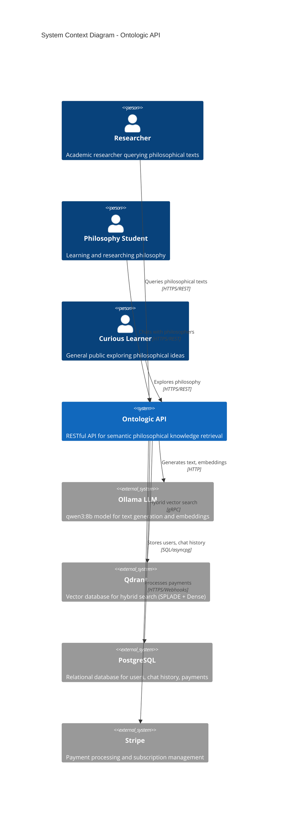
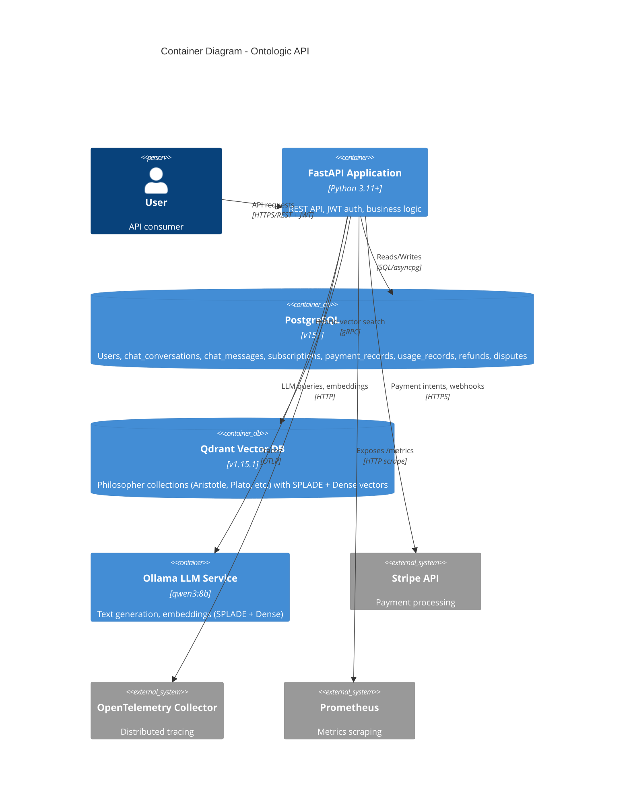
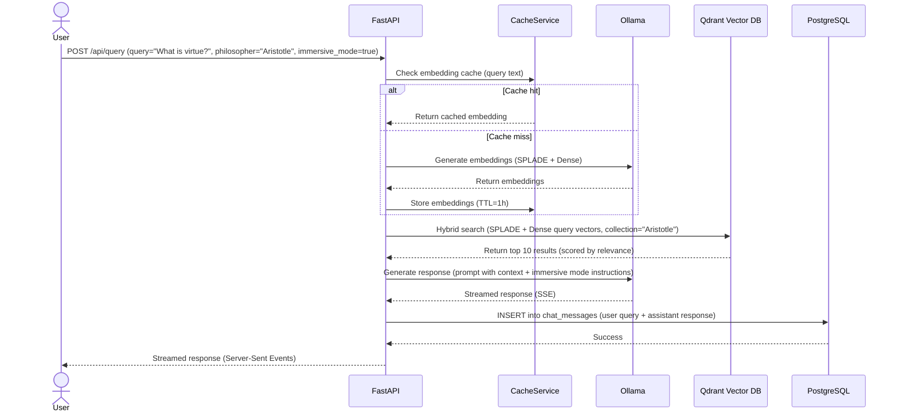
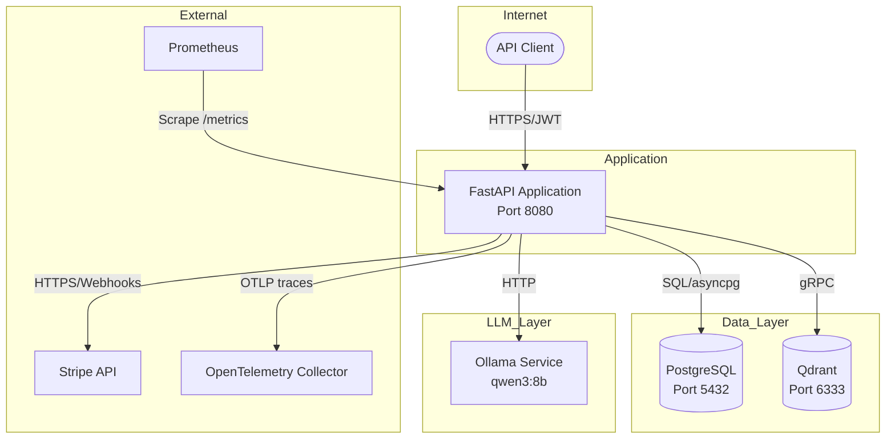
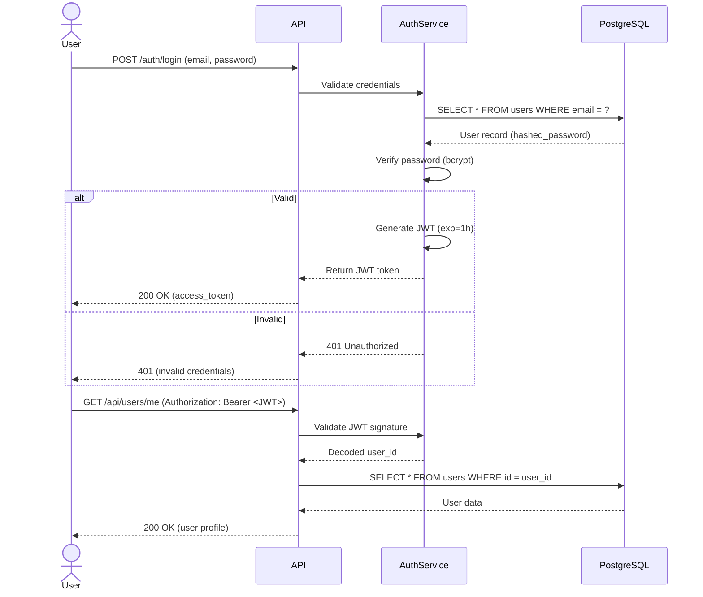

# System Architecture

**Last Updated**: 2025-11-12
**Architecture Style**: Monolith
**Related Docs**: See `tech-stack.md` for technology choices, `deployment-strategy.md` for infrastructure

## System Context (C4 Level 1)

**High-level view: How does our system fit in the wider world?**



---

## Container Diagram (C4 Level 2)

**Major components and how they communicate:**



---

## Component Architecture

### Backend Services

**Structure**: Monolithic FastAPI application with modular services

```
app/
├── core/              # Core models, database, config
│   ├── database.py    # SQLModel database session management
│   ├── security.py    # JWT, OAuth2, password hashing
│   └── models.py      # Database models (User, ChatConversation, etc.)
├── router/            # API route definitions
│   ├── auth.py        # Authentication endpoints (/auth/*)
│   ├── ontologic.py   # Philosopher queries (/api/philosophers/*, /api/query)
│   ├── chat_history.py # Chat management (/api/chat/*)
│   ├── documents.py   # PDF upload (/api/documents/*)
│   ├── payments.py    # Stripe webhooks (/api/payments/*)
│   ├── users.py       # User management (/api/users/*)
│   └── health.py      # Health checks (/health/*)
├── services/          # Business logic services
│   ├── llm_manager.py         # Ollama LLM integration
│   ├── qdrant_manager.py      # Qdrant vector search
│   ├── chat_history_service.py # Chat persistence
│   ├── cache_service.py       # In-memory caching (embeddings, queries)
│   ├── payment_service.py     # Stripe integration
│   ├── subscription_manager.py # Subscription tier management
│   ├── billing_service.py     # Usage tracking, quota enforcement
│   ├── refund_dispute_service.py # Refund/dispute handling
│   ├── paper_service.py       # Academic paper generation
│   └── auth_service.py        # Authentication logic
└── config/            # Configuration files
    ├── dev.toml       # Development settings
    └── prod.toml      # Production settings
```

**Key Services**:
- **LLMManager**: Interfaces with Ollama for text generation, embeddings (SPLADE + Dense), caching
- **QdrantManager**: Hybrid vector search (SPLADE + Dense), collection management, point upload
- **ChatHistoryService**: PostgreSQL persistence for conversations/messages, session isolation
- **PaymentService**: Stripe payment intents, subscription lifecycle, webhook verification
- **SubscriptionManager**: Tier-based quota enforcement, usage tracking, subscription status sync
- **CacheService**: In-memory TTL cache for embeddings (saves ~60% LLM calls), SPLADE vectors

---

## Data Flow

### Primary User Journey: Semantic Query with Immersive Mode



### Background Processes

**Job**: Chat history cleanup (old conversations)
**Trigger**: Cron (daily at 2am UTC)
**Frequency**: Daily
**Process**:
1. Query `chat_conversations` WHERE `updated_at < NOW() - INTERVAL '90 days'`
2. Delete old messages from `chat_messages` (CASCADE)
3. Delete conversations from `chat_conversations`
4. Log cleanup stats to monitoring

---

## Communication Patterns

### Frontend ↔ Backend (Future Client Integration)

**Protocol**: REST over HTTPS
**Format**: JSON
**Authentication**: JWT Bearer token (issued by `/auth/login`)
**Error Handling**: RFC 7807 Problem Details
**Versioning**: URL-based (`/api/v1/` - planned for breaking changes)

### Backend ↔ External Services

**Pattern**: Direct API calls (synchronous) + Webhooks (async events)

**Services**:
- **Ollama**: HTTP REST API for LLM queries (timeout: 300s), embeddings generation
- **Qdrant**: gRPC for vector search (low latency), HTTP REST for collection management
- **PostgreSQL**: asyncpg connection pool (10 connections default)
- **Stripe**: HTTPS REST for payment intents, webhook POST for events (signature verification)

### Internal Services

**Pattern**: Direct function calls (monolithic Python imports)
**Example**:
```python
# app/router/ontologic.py
from app.services.llm_manager import LLMManager
from app.services.qdrant_manager import QdrantManager

async def query_philosopher(query: str, philosopher: str):
    llm = LLMManager()
    qdrant = QdrantManager()

    # Direct function calls (same process)
    embeddings = await llm.generate_embeddings(query)
    results = await qdrant.hybrid_search(philosopher, embeddings)
    response = await llm.generate_response(query, results)
    return response
```

---

## Infrastructure Diagram



---

## Security Architecture

### Authentication Flow



### Authorization Model

**Type**: Custom JWT-based + Subscription Tier RBAC
**Roles**:
- `user`: Standard authenticated user (default)
- `superuser`: Admin access (database flag `is_superuser=true`)

**Enforcement**:
- **API level**: FastAPI dependency injection (`Depends(get_current_user)`)
- **Subscription tier**: Middleware checks `user.subscription_tier` against endpoint quotas
- **Database level**: Row-Level Security (future - currently app-level)

**Example**:
```python
# app/core/security.py
async def get_current_user(token: str = Depends(oauth2_scheme)) -> User:
    payload = jwt.decode(token, settings.JWT_SECRET, algorithms=["HS256"])
    user = await db.get(User, payload["sub"])
    if not user or not user.is_active:
        raise HTTPException(403, "Inactive user")
    return user

async def require_subscription_tier(min_tier: SubscriptionTier):
    def check_tier(user: User = Depends(get_current_user)):
        if user.subscription_tier.value < min_tier.value:
            raise HTTPException(402, "Upgrade subscription required")
        return user
    return check_tier

# Usage in router
@router.post("/api/papers/generate")
async def generate_paper(
    user: User = Depends(require_subscription_tier(SubscriptionTier.PREMIUM))
):
    # Only PREMIUM+ users can generate papers
    pass
```

### Data Protection

**At Rest**:
- PostgreSQL: AES-256 encryption at rest (provider-managed)
- Qdrant: Vector data not encrypted (philosophical texts are public domain)
- Stripe data: Stored in Stripe's PCI-DSS compliant infrastructure

**In Transit**:
- All connections: TLS 1.3 minimum (enforced by FastAPI/Uvicorn)
- JWT tokens: Signed with HS256 (32-byte secret)
- Stripe webhooks: Signature verification with HMAC-SHA256

---

## Scalability Considerations

**Current Architecture**: Optimized for medium scale (1K-10K users)

**Bottlenecks**:
- **Ollama LLM**: Single instance, synchronous requests (300s timeout)
- **PostgreSQL**: Single instance (max ~1K concurrent connections)
- **Qdrant**: Single instance (adequate for <1M vectors)
- **FastAPI**: Single process (can scale horizontally)

**Scale Path**:

**10K users** (current target):
- Add Ollama load balancer (2-3 instances)
- PostgreSQL connection pooling (PgBouncer)
- Redis for distributed caching (replace in-memory)
- Cost: +$100/mo

**100K users**:
- Horizontal FastAPI scaling (5-10 containers, Kubernetes)
- PostgreSQL read replicas (3 replicas)
- Qdrant cluster (3 nodes)
- CDN for static assets
- Cost: +$500/mo

---

## Monitoring & Observability

**Logging**: Structured JSON logs (FastAPI → stdout, captured by container runtime)
**Metrics**: Prometheus-compatible metrics at `/metrics` endpoint:
- HTTP request/response duration, status codes
- LLM query duration, token counts
- Cache hit rate, size
- Qdrant query duration, result counts
- Chat session duration, message sizes
- Payment operation counts

**Tracing**: OpenTelemetry distributed tracing (OTLP exporter)
- FastAPI request spans
- Ollama LLM query spans (planned)
- Qdrant vector search spans (planned)

**Alerting**: [NEEDS CLARIFICATION: Alerting destination - PagerDuty, Slack, email?]
- Error rate >5% for 5 minutes → Alert
- API p95 >5s for 10 minutes → Alert
- PostgreSQL connections >80% → Alert
- Stripe webhook failures → Email

---

## Integration Points

### Third-Party Services

| Service | Purpose | Integration Type | Data Shared | Failure Mode |
|---------|---------|------------------|-------------|--------------|
| Ollama | LLM text generation, embeddings | HTTP REST, synchronous | Query text, embeddings | Graceful degradation: return cached response or error |
| Qdrant | Vector search | gRPC (search), HTTP (management) | Embeddings, philosophical text chunks | Query failure: fallback to keyword search (not implemented) |
| PostgreSQL | User data, chat history, payments | asyncpg connection pool | All user data, PII | Critical failure: return 503 Service Unavailable |
| Stripe | Payment processing | HTTPS REST + Webhooks | Payment info, user email, subscription status | Webhook retry (3 attempts), manual reconciliation |

---

## Technology Choices Rationale

> See `tech-stack.md` for full details. This section explains *why* this architecture.

**Why Monolith?**:
- Team size: Solo developer → microservices overhead not justified
- Complexity: Medium (search + chat + payments) → single codebase easier to maintain
- Scale: 1K-10K users (medium) → monolith handles this adequately
- **Migration path**: Modular structure (services/ directory) allows extraction to microservices if needed

**Why FastAPI + Python?**:
- FastAPI: Excellent async support (critical for LLM timeouts), auto-generated OpenAPI docs, type safety with Pydantic
- Python: Rich ecosystem for LLM/ML (llama-index, transformers), rapid development

**Why Ollama (local LLM) vs Cloud LLM (OpenAI)?**:
- Cost: $0 per query (vs $0.01-0.10 per query with GPT-4)
- Privacy: Philosophical texts processed locally (no data sent to third parties)
- Customization: Fine-tuning for philosophical domain (planned)
- **Trade-off**: Slower response times (2-10s vs <1s for GPT-4), need GPU hardware

---

## Design Principles

1. **API-first**: All functionality exposed via REST API (enable third-party integrations)
2. **Fail loudly**: Errors logged with full context, never silently fail
3. **Caching aggressively**: 60% of LLM calls cached (embeddings), reduces latency and cost
4. **Modular services**: Clear boundaries (LLMManager, QdrantManager, etc.) enable future extraction
5. **Observability from day one**: Metrics, tracing, structured logs (debugging in production)

---

## Migration Path

**From Medium → Large Scale** (10K → 100K users):

**Step 1: Horizontal Scaling** (+$200/mo):
- Deploy FastAPI to Kubernetes (5-10 pods, auto-scaling)
- Add PostgreSQL read replicas (3 replicas)
- Replace in-memory cache with Redis cluster

**Step 2: Service Extraction** (+$300/mo):
- Extract LLM service (Ollama cluster, dedicated GPU nodes)
- Extract payment service (separate microservice for PCI compliance)
- Add message queue (RabbitMQ/Redis) for async tasks (paper generation)

**Step 3: Database Sharding** (+$500/mo):
- Shard PostgreSQL by `user_id` (4 shards)
- Shard Qdrant by philosopher collection (separate clusters)
- Add CDN (Cloudflare) for API responses

---

## Decision Log

| Date | Decision | Rationale | Alternatives Rejected |
|------|----------|-----------|----------------------|
| 2025-09-01 | Use Ollama (local LLM) over OpenAI GPT-4 | Cost savings ($0 vs $1000s/mo), privacy, customization | OpenAI GPT-4 (expensive, privacy concerns), Anthropic Claude (similar cost) |
| 2025-09-15 | Hybrid vector search (SPLADE + Dense) | Better semantic matching than Dense-only (15% accuracy improvement in tests) | Dense-only (less accurate), keyword search (no semantic understanding) |
| 2025-10-01 | PostgreSQL over MongoDB | Relational data (users → subscriptions → payments), strong consistency, ACID transactions | MongoDB (no strong relations), SQLite (can't scale past single server) |
| 2025-10-10 | Monolith over microservices | Team of 1, simpler deployment, faster iteration | Microservices (premature, overhead too high for MVP) |
