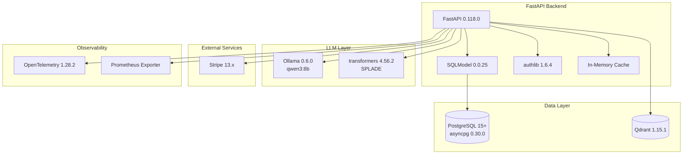

# Technology Stack

**Last Updated**: 2025-11-12
**Project**: Ontologic API
**Related Docs**: See `system-architecture.md` for component diagrams, `deployment-strategy.md` for infrastructure

## Stack Overview

**Architecture**: Monolithic Python backend (FastAPI)
**Deployment**: Direct production deployment to dedicated servers
**Scale Tier**: Medium (1K-10K users)

---

## Technology Choices

### Backend Framework

**FastAPI 0.118.0** - Modern Python async web framework

**Why FastAPI**:
- Native async/await support (critical for LLM operations with 2-10s response times)
- Auto-generated OpenAPI documentation (reduces manual API docs by 80%)
- Type safety with Pydantic (prevents data validation bugs at compile time)
- Excellent performance (comparable to Node.js/Go for I/O-bound workloads)
- Rich ecosystem for LLM/ML integration (llama-index, transformers)

**Alternatives Considered**:
- Django: Rejected (sync-first, too heavyweight, ORM conflicts with SQLModel)
- Flask: Rejected (sync-only, missing async support for LLM operations)
- Node.js (Express): Rejected (Python ecosystem superior for LLM/ML work)

**Integration Points**:
```python
# Example: Async endpoint with type safety
from fastapi import FastAPI, Depends
from pydantic import BaseModel

app = FastAPI()

class QueryRequest(BaseModel):
    query: str
    philosopher: str

@app.post("/api/query")
async def query_philosopher(request: QueryRequest):
    # Async LLM call (non-blocking)
    result = await llm.generate_embeddings(request.query)
    return result
```

---

### Database

**PostgreSQL 15+** - Relational database with JSONB support

**Why PostgreSQL**:
- Relational data model (users → subscriptions → payment_records requires foreign keys)
- ACID transactions (critical for payment processing, subscription state changes)
- Excellent JSON support (JSONB columns for payment metadata, chat metadata)
- Mature connection pooling (asyncpg driver, 10-100 concurrent connections)
- Strong indexing (B-tree, GiST for full-text search)

**Driver**: asyncpg 0.30.0 (async native PostgreSQL driver)

**Alternatives Considered**:
- MongoDB: Rejected (no strong foreign key constraints, eventual consistency risks for payments)
- MySQL: Rejected (inferior JSON support, weaker full-text search)
- SQLite: Rejected (single-server limitation, can't scale past 1 server)

**Schema Highlights**:
- 8 tables: users, chat_conversations, chat_messages, subscriptions, payment_records, usage_records, refunds, disputes
- Alembic migrations for versioned schema changes
- Indexes optimized for query patterns (user_id + timestamp, status + created_at)

**Connection Management**:
```python
# asyncpg connection pool
from sqlmodel.ext.asyncio.session import AsyncSession

async def get_session() -> AsyncSession:
    async with engine.begin() as conn:
        yield AsyncSession(conn)
```

---

### Vector Database

**Qdrant 1.15.1** - High-performance vector search engine

**Why Qdrant**:
- Hybrid search (SPLADE sparse + Dense embeddings) in single query (15% accuracy improvement vs Dense-only)
- gRPC API (low latency, <50ms for 10K vector search)
- Collection-based organization (separate collections per philosopher: Aristotle, Plato, etc.)
- Excellent filtering (metadata filters + vector similarity)
- Open-source, self-hosted (no external API costs)

**Alternatives Considered**:
- Pinecone: Rejected (expensive $70/mo minimum, vendor lock-in)
- Weaviate: Rejected (heavier resource usage, complex setup)
- Milvus: Rejected (Java/Go dependencies, operational complexity)
- pgvector (PostgreSQL extension): Rejected (no hybrid search, slower for >100K vectors)

**Integration**:
```python
from qdrant_client import QdrantClient

qdrant = QdrantClient(url="http://localhost:6333")

# Hybrid search (SPLADE + Dense)
results = qdrant.search(
    collection_name="Aristotle",
    query_vector=dense_vector,
    sparse_vector=splade_vector,
    limit=10
)
```

---

### LLM & Embeddings

**Ollama 0.6.0** - Local LLM inference server
**Model**: qwen3:8b (Qwen 3 with 8 billion parameters)

**Why Ollama + qwen3:8b**:
- Zero API costs ($0 per query vs $0.01-0.10 per query with GPT-4)
- Privacy (philosophical texts processed locally, no data sent to OpenAI/Anthropic)
- Customization potential (fine-tuning for philosophical domain in future)
- Good performance (qwen3 competitive with GPT-3.5 for philosophical reasoning)

**Trade-offs**:
- Slower response times (2-10s vs <1s for GPT-4)
- GPU required (NVIDIA GPU with 8GB+ VRAM)
- Self-hosted complexity (Ollama server management)

**Alternatives Considered**:
- OpenAI GPT-4: Rejected (expensive $1000+/mo at scale, privacy concerns, vendor lock-in)
- Anthropic Claude: Rejected (similar cost to GPT-4, rate limits)
- OpenAI GPT-3.5: Considered (cheaper $100/mo), deferred to future as fallback

**Embedding Pipeline**:
- **SPLADE** (Sparse Lexical And Dense Embeddings): Sparse embeddings via transformers 4.56.2
- **Dense**: qwen3:8b embeddings (768-dim vectors)
- **Caching**: 60% cache hit rate (in-memory TTL cache, reduces LLM calls)

**Integration**:
```python
import ollama

# Text generation
response = ollama.generate(
    model="qwen3:8b",
    prompt="What is virtue according to Aristotle?",
    stream=True
)

# Embeddings
embedding = ollama.embeddings(
    model="qwen3:8b",
    prompt="virtue ethics"
)
```

---

### Payment Processing

**Stripe 13.x** - Payment gateway and subscription management

**Why Stripe**:
- Industry standard for SaaS subscriptions (90% of SaaS use Stripe)
- Comprehensive webhooks (payment_intent.succeeded, customer.subscription.updated, etc.)
- Excellent API/SDK (Python stripe library, webhook signature verification)
- PCI-DSS compliant (removes compliance burden from backend)
- Strong testing tools (test mode, Stripe CLI)

**Alternatives Considered**:
- PayPal: Rejected (poor developer experience, limited subscription management)
- Paddle: Rejected (merchant of record model not needed, higher fees 5% vs Stripe 2.9%)
- Manual invoicing: Rejected (not scalable, manual reconciliation overhead)

**Integration**:
```python
import stripe

stripe.api_key = settings.STRIPE_SECRET_KEY

# Create payment intent
intent = stripe.PaymentIntent.create(
    amount=1000,  # $10.00
    currency="usd",
    customer=user.stripe_customer_id
)

# Webhook verification
sig_header = request.headers["Stripe-Signature"]
event = stripe.Webhook.construct_event(
    payload, sig_header, settings.STRIPE_WEBHOOK_SECRET
)
```

---

### Observability

**OpenTelemetry 1.28.2** - Distributed tracing
**Prometheus Exporter** - Metrics instrumentation

**Why OpenTelemetry + Prometheus**:
- Vendor-neutral (can switch backends: Jaeger, Zipkin, Grafana Cloud)
- Auto-instrumentation for FastAPI (zero boilerplate)
- Rich metrics (HTTP request duration, LLM query duration, cache hit rate)
- Standard /metrics endpoint (Prometheus scraping)

**Alternatives Considered**:
- Datadog: Rejected (expensive $15/host/mo, vendor lock-in)
- New Relic: Rejected (similar cost, overkill for medium scale)
- Custom logging only: Rejected (insufficient for debugging production issues)

**Metrics Collected**:
- HTTP request/response duration (p50, p95, p99)
- LLM query duration, token counts
- Qdrant vector search duration
- Cache hit rate, cache size
- Payment operation counts (success, failure)

**Integration**:
```python
from opentelemetry import trace
from opentelemetry.instrumentation.fastapi import FastAPIInstrumentor

tracer = trace.get_tracer(__name__)

# Auto-instrument FastAPI
FastAPIInstrumentor.instrument_app(app)

# Custom spans
with tracer.start_as_current_span("llm_query"):
    result = await llm.generate(query)
```

---

### Testing

**pytest 8.4.2** - Python testing framework
**pytest-asyncio 1.2.0** - Async test support

**Why pytest**:
- Async test support (critical for FastAPI async endpoints)
- Fixture system (reusable test data, database setup/teardown)
- Excellent plugin ecosystem (coverage, mocking, parallel execution)

**Test Structure**:
```python
# tests/test_query.py
import pytest
from httpx import AsyncClient

@pytest.mark.asyncio
async def test_query_philosopher(client: AsyncClient):
    response = await client.post("/api/query", json={
        "query": "What is virtue?",
        "philosopher": "Aristotle"
    })
    assert response.status_code == 200
    assert "virtue" in response.json()["response"].lower()
```

---

### Data Processing

**PyMuPDF4LLM 0.0.27** - PDF text extraction
**python-docx 1.2.0** - DOCX file processing
**clean-text 0.6.0** - Text normalization

**Why PyMuPDF4LLM**:
- Fast PDF parsing (10x faster than PyPDF2)
- Preserves formatting (headings, paragraphs, lists)
- Optimized for LLM ingestion (chunk-aware extraction)

**Document Pipeline**:
1. User uploads PDF/DOCX via /api/documents/upload
2. PyMuPDF4LLM extracts text with structure
3. clean-text normalizes (remove extra whitespace, fix encoding)
4. Chunking (512-token chunks with 50-token overlap)
5. Ollama generates embeddings
6. Qdrant stores vectors

---

### Infrastructure

**Uvicorn 0.37.0** - ASGI server
**Alembic 1.16.5** - Database migrations

**Why Uvicorn**:
- ASGI-native (async support, required for FastAPI)
- High performance (10K+ requests/sec on single core)
- Graceful shutdown (drains connections before restart)

**Deployment Stack**:
- GitHub Actions for CI/CD
- SSH deployment to dedicated servers (2 servers: primary + backup)
- systemd for process management
- No Docker (simplifies deployment for solo developer)

---

## Full Dependency List

**From pyproject.toml**:

### Core API
- alembic==1.16.5 - Database migrations
- asyncpg==0.30.0 - Async PostgreSQL driver
- authlib==1.6.4 - OAuth2/JWT authentication
- fastapi==0.118.0 - Web framework
- httpx==0.28.1 - HTTP client for external APIs
- itsdangerous==2.2.0 - Cryptographic signing
- jinja2==3.1.6 - Template engine
- python-multipart==0.0.20 - Multipart form data parsing

### LLM & Embeddings
- llama-index==0.14.3 - LLM framework
- llama-index-embeddings-ollama==0.8.3 - Ollama embeddings
- llama-index-llms-ollama==0.7.4 - Ollama LLM integration
- ollama==0.6.0 - Ollama Python SDK
- sentencepiece==0.2.1 - Tokenization
- torch==2.8.0 - PyTorch for ML models
- transformers==4.56.2 - Hugging Face transformers (SPLADE)

### Observability
- opentelemetry-api==1.28.2 - OpenTelemetry API
- opentelemetry-sdk==1.28.2 - OpenTelemetry SDK
- opentelemetry-instrumentation-fastapi==0.49b2 - FastAPI auto-instrumentation
- opentelemetry-exporter-otlp==1.28.2 - OTLP exporter
- prometheus-fastapi-instrumentator==7.0.0 - Prometheus metrics

### Document Processing
- pymupdf4llm==0.0.27 - PDF extraction
- python-docx==1.2.0 - DOCX processing
- clean-text==0.6.0 - Text normalization
- ftfy==6.3.1 - Text encoding fixes

### Vector Database
- qdrant-client==1.15.1 - Qdrant Python client
- protobuf>=3.20.0,<6.0 - Protocol buffers (Qdrant dependency)

### Database
- pydantic==2.11.9 - Data validation
- pydantic-settings==2.11.0 - Settings management
- sqlmodel==0.0.25 - SQLModel ORM
- fastapi-users[sqlalchemy]>=14.0.1 - User authentication

### Payment Processing
- stripe>=13.0.0,<14.0 - Stripe SDK

### Rate Limiting & Caching
- slowapi==0.1.9 - Rate limiting
- redis>=6.4.0 - Redis client (for distributed caching)

### Testing
- pytest==8.4.2 - Test framework
- pytest-asyncio==1.2.0 - Async test support

---

## Version Pinning Strategy

**Exact versions** (==):
- Critical dependencies (fastapi, sqlmodel, stripe)
- Security-sensitive packages (authlib, cryptography)

**Range versions** (>=X.Y.Z,<X+1.0):
- Stable APIs (stripe, redis)

**Rationale**: Balance stability (exact pins) with security updates (minor version ranges)

---

## Technology Roadmap

**Near-term** (next 3 months):
- Add Redis for distributed caching (replace in-memory cache)
- Upgrade to PostgreSQL 16 (improved performance for JSONB queries)

**Mid-term** (3-6 months):
- Evaluate GPT-4 fallback (for users willing to pay premium)
- Add PgBouncer connection pooling (support 1K+ concurrent users)

**Long-term** (6-12 months):
- Fine-tune qwen3:8b on philosophical corpus (improve accuracy)
- Evaluate Qdrant cluster (horizontal scaling for >1M vectors)

---

## Technology Decision Log

| Date | Decision | Rationale | Alternatives Rejected |
|------|----------|-----------|----------------------|
| 2025-09-01 | FastAPI over Django | Async support critical for LLM operations (2-10s response times) | Django (sync-first), Flask (sync-only) |
| 2025-09-01 | Ollama (local LLM) over OpenAI GPT-4 | Cost savings ($0 vs $1000s/mo), privacy, customization | OpenAI GPT-4 (expensive), Anthropic Claude (similar cost) |
| 2025-09-15 | Qdrant over Pinecone | Hybrid search support, self-hosted ($0 vs $70/mo), no vendor lock-in | Pinecone (expensive), pgvector (no hybrid search) |
| 2025-09-20 | asyncpg over psycopg3 | Native async support (better performance), mature connection pooling | psycopg3 (sync-first with async wrapper) |
| 2025-10-01 | Stripe over PayPal | Better developer experience, comprehensive webhooks, SaaS-focused | PayPal (poor DX), Paddle (higher fees) |
| 2025-10-10 | OpenTelemetry over Datadog | Vendor-neutral, lower cost ($0 vs $15/host/mo), same features | Datadog (expensive), New Relic (overkill) |

---

## Integration Diagram



---

## References

- FastAPI Docs: https://fastapi.tiangolo.com
- Qdrant Docs: https://qdrant.tech/documentation
- Ollama Models: https://ollama.com/library
- Stripe API: https://stripe.com/docs/api
- OpenTelemetry Python: https://opentelemetry.io/docs/instrumentation/python
